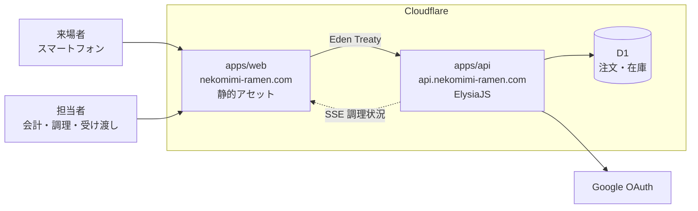

<div align="center">

# 猫耳メイドラーメン

**文化祭のクラス出店のための、注文から受け渡しまでを繋ぐ Web アプリケーション**

[](https://github.com/koutyuke/nekomimi-maid-ramen/actions/workflows/ci.yml)

2026 年 10 月末開催 ・ [nekomimi-ramen.com](https://nekomimi-ramen.com)

</div>

---

## これは何か

来場者は注文兼会計口で商品と個数を口頭で伝え、会計担当者が画面へ入力する。注文を確定した時点で在庫を減らし、注文番号を発行して調理担当者へ共有する。完成した注文は番号で照合して受け渡す。

口頭だけで会計から調理へ伝える運用では、注文漏れ、手計算の会計ミス、売り切れ商品の受付、受け渡しの取り違えが起きやすい。**同じ注文状況を全担当者が見られる状態を作ること**が目的である。

来場者は店へ着く前に、メニューと売り切れを確認できる。

利用者と全体像は[プロジェクト概要](docs/product/overview.md)を読む。

## 構成



2 つの Worker を別々のホストへ割り当て、**別々に配備する**。営業中に画面だけを直したいとき、API を巻き込んで Server-Sent Events の接続を切らないためである。

| 作業単位   | 配備先                   | 主な構成                                           |
| ---------- | ------------------------ | -------------------------------------------------- |
| `apps/web` | `nekomimi-ramen.com`     | React ・ Vite ・ TanStack Router ・ Mantine        |
| `apps/api` | `api.nekomimi-ramen.com` | ElysiaJS ・ Effect ・ Drizzle ORM ・ Cloudflare D1 |

画面は Eden Treaty で `apps/api` の型を読む。依存の向きは画面から API への一方向に限り、API は画面の実装を参照しない。

API の内部は**業務領域で縦割り**にする。`src/features/{領域}/` の下に `domain`、`application`、`adapters`、`infra` を置き、仕様([`docs/specs/`](docs/specs/))と同じ切り方で読めるようにしている。エラーと依存は Effect の型に載せ、扱い忘れた失敗が型検査で残るようにする。

判断の根拠は [`DEC-SYS-003` 実行基盤とデータストア](docs/meta/decisions/DEC-SYS-003-technology-stack.md)、[`DEC-SYS-004` 開発環境とツールチェーン](docs/meta/decisions/DEC-SYS-004-development-environment.md)、[`DEC-SYS-005` API の内部構造とエラー処理](docs/meta/decisions/DEC-SYS-005-api-internal-structure.md)にある。

## 準備

[Nix](https://nixos.org/download/) と [direnv](https://direnv.net/) を入れてから、

```sh
direnv allow
pnpm install
```

以降このディレクトリへ入るだけで Node.js と pnpm の版が揃う。direnv を使わない場合は各コマンドを `nix develop --command` の後ろに置く。

## 開発

```sh
pnpm dev                          # 画面と API を同時に起動する
pnpm --filter @nekomimi/web dev   # 画面だけ
pnpm --filter @nekomimi/api dev   # API だけ
pnpm --filter @nekomimi/web sb    # 画面部品のカタログ
```

初回と表定義を変えたときは、手元の D1 へ移行を当てる。

```sh
pnpm --filter @nekomimi/api db:generate       # 表定義から移行ファイルを作る
pnpm --filter @nekomimi/api db:migrate:local  # 手元の D1 へ適用する
```

画面が呼び出す API の送信元は `VITE_API_ORIGIN` で指定する。未指定なら `wrangler dev` の待ち受け先(`http://localhost:8787`)を使う。

## 検査

```sh
pnpm check       # 下の 4 つをまとめて実行する
pnpm lint        # oxlint。型情報を使う検査を含む
pnpm format      # oxfmt。--check を付けると書き換えずに判定する
pnpm typecheck
pnpm test
```

`no-floating-promises` などの型情報を使う検査を有効にしている。注文の保存と在庫の減算は一つのバッチとして実行するため、`await` の書き忘れがエラーを出さないまま在庫を壊す。型情報がなければこの誤りは見つからない。

コミット時に整形と静的検査、プッシュ時に型検査と試験が lefthook で走る。

## 配備

`main` へ統合すると GitHub Actions が配備する。**変更された Worker だけ**が対象になる。

| ワークフロー      | 契機                           | 内容                                 |
| ----------------- | ------------------------------ | ------------------------------------ |
| `ci.yml`          | プルリクエスト ・ `main`       | 静的検査、整形、型検査、試験、ビルド |
| `deploy-api.yml`  | `main` の `apps/api/**`        | 型検査、試験、D1 の移行適用、配備    |
| `deploy-web.yml`  | `main` の `apps/web/**`        | 型検査、試験、ビルド、配備           |
| `preview-web.yml` | プルリクエストの `apps/web/**` | プレビュー版の作成と Lighthouse 計測 |

配備するジョブは Environment `production` に属する。出店当日だけ Settings → Environments → production で Required reviewers を有効にすると承認待ちへ切り替わる。ワークフローの変更は要らない。

手元から配備する場合は次を使う。

```sh
pnpm --filter @nekomimi/api exec wrangler deploy
pnpm --filter @nekomimi/web run build && pnpm --filter @nekomimi/web exec wrangler deploy
```

## 外部サービスの設定

`wrangler login` と D1 の作成、GitHub のシークレット登録は済んでいる。残りは次のとおり。

```sh
# Google OAuth の秘密情報を Worker へ登録する
pnpm --filter @nekomimi/api exec wrangler secret put GOOGLE_CLIENT_ID
pnpm --filter @nekomimi/api exec wrangler secret put GOOGLE_CLIENT_SECRET
```

Google Cloud 側でクライアントを作り、戻り先 URL を登録する。スタッフのログインは `gm.ibaraki-ct.ac.jp` ドメインに限る。

`nekomimi-ramen.com` と `api.nekomimi-ramen.com` の Custom Domain 割り当ては、初回の配備時に `wrangler` が作成する。

## 文書

要件と仕様は [`docs/`](docs/README.md) にある。

| 場所                             | 役割                               |
| -------------------------------- | ---------------------------------- |
| [`docs/product/`](docs/product/) | 目的、利用者、体験、用語           |
| [`docs/meta/`](docs/meta/)       | 要件、判断、未決事項、提供範囲     |
| [`docs/specs/`](docs/specs/)     | 業務領域ごとの振る舞いと受け入れ例 |

文書を更新する前に[ドキュメント管理](docs/documentation-management.md)を読む。ブランチを切る前とプルリクエストを作る前に[変更管理](docs/change-management.md)を読む。
