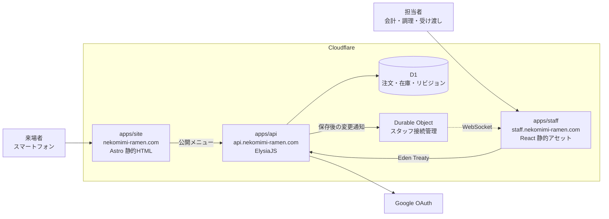

<div align="center">

# 猫耳メイドラーメン

**文化祭のクラス出店のための、注文から受け渡しまでを繋ぐ Web アプリケーション**

[](https://github.com/koutyuke/nekomimi-maid-ramen/actions/workflows/ci.yml)

2026 年 10 月末開催 ・ [nekomimi-ramen.com](https://nekomimi-ramen.com)

</div>

---

## これは何か

来場者は注文兼会計口で商品と個数を口頭で伝え、会計担当者が画面へ入力する。注文を確定した時点で在庫を減らし、注文番号を発行して調理担当者へ共有する。完成した注文は番号で照合して受け渡す。

口頭だけで会計から調理へ伝える運用では、注文漏れ、手計算の会計ミス、売り切れ商品の受付、受け渡しの取り違えが起きやすい。**同じ注文状況を全担当者が見られる状態を作ること**が目的である。

来場者は店へ着く前に、メニューと売り切れを確認できる。

利用者と全体像は[プロジェクト概要](docs/product/overview.md)を読む。

## 構成



3 つの Worker を別々のホストへ割り当て、**別々に配備する**。営業中に画面だけを直したいとき、API を巻き込んで スタッフの通知接続を切らないためである。

| 作業単位     | 配備先                     | 主な構成                                                               |
| ------------ | -------------------------- | ---------------------------------------------------------------------- |
| `apps/site`  | `nekomimi-ramen.com`       | Astro ・ TypeScript ・ Tailwind CSS                                    |
| `apps/staff` | `staff.nekomimi-ramen.com` | React ・ Vite ・ TanStack Router ・ TanStack Query ・ Jotai ・ Mantine |
| `apps/api`   | `api.nekomimi-ramen.com`   | ElysiaJS ・ Effect ・ Drizzle ORM ・ Cloudflare D1 ・ Durable Objects  |

画面は Eden Treaty で `apps/api` の型を読む。依存の向きは画面から API への一方向に限り、API は画面の実装を参照しない。

API の内部は**業務領域で縦割り**にする。`src/features/{領域}/` の下に `domain`、`application`、`adapters`、`infra` を置き、仕様([`docs/specs/`](docs/specs/))と同じ切り方で読めるようにしている。エラーと依存は Effect の型に載せ、扱い忘れた失敗が型検査で残るようにする。

公開側はAstroで静的HTMLを生成し、メニュー取得とテーマ選択だけをブラウザーで実行する。テーマはライト・ダーク・端末設定の3択で、選択をブラウザーへ保存する。

スタッフ画面の内部も同じ業務領域で切る。`src/layers/` の下を Feature-Sliced Design の層(`app`、`pages`、`widgets`、`features`、`entities`、`shared`)で分け、部品は表示だけを担う Presenter と副作用を担う Container に分ける。

判断の根拠は [`DEC-SYS-003` 実行基盤とデータストア](docs/meta/decisions/DEC-SYS-003-technology-stack.md)、[`DEC-SYS-004` 開発環境とツールチェーン](docs/meta/decisions/DEC-SYS-004-development-environment.md)、[`DEC-SYS-005` API の内部構造とエラー処理](docs/meta/decisions/DEC-SYS-005-api-internal-structure.md)、[`DEC-SYS-006` 画面の内部構造と状態管理](docs/meta/decisions/DEC-SYS-006-web-internal-structure.md)にある。

## 準備

[Nix](https://nixos.org/download/) と [direnv](https://direnv.net/) を入れてから、

```sh
direnv allow
pnpm install
```

以降このディレクトリへ入るだけで Node.js と pnpm の版が揃う。direnv を使わない場合は各コマンドを `nix develop --command` の後ろに置く。

## 開発

```sh
pnpm dev                          # 公開側・スタッフ側・APIを同時に起動する
pnpm --filter @nekomimi/site dev  # 公開側だけ
pnpm --filter @nekomimi/staff dev # スタッフ側だけ
pnpm --filter @nekomimi/api dev   # API だけ
pnpm site sb                      # 公開側のStorybook（localhost:6007）
pnpm staff sb                     # スタッフ側のStorybook（localhost:6006）
pnpm site sb:build                # 公開側のStorybookを静的出力する
```

API の起動後は、[`http://localhost:8787/openapi`](http://localhost:8787/openapi) で API リファレンス、[`http://localhost:8787/openapi/json`](http://localhost:8787/openapi/json) で OpenAPI 仕様を確認できる。

初回と表定義を変えたときは、手元の D1 へ移行を当てる。

```sh
pnpm --filter @nekomimi/api db:generate       # 表定義から移行ファイルを作る
pnpm --filter @nekomimi/api db:migrate:local  # 手元の D1 へ適用する
pnpm --filter @nekomimi/api db:seed:local     # メニューと初期在庫を投入する
pnpm --filter @nekomimi/api db:studio         # 手元の D1 を Drizzle Studio で開く
```

投入する内容は `apps/api/seed.sql` にある。[メニュー](docs/product/menu.md)の6商品、特定原材料の9品目、全商品を販売可能にする初期在庫を入れる。品目の追加や価格の変更はこのファイルを直して投入し直す。何度実行しても行は重複せず、投入後に更新された説明文・原材料の確認状態・在庫数は上書きしない。

本番へ入れる場合は、移行を当てた後に `db:seed:remote` を実行する。

```sh
pnpm --filter @nekomimi/api db:seed:remote
```

画面とAPIのURLは共有パッケージの[`packages/core/src/http/url.ts`](packages/core/src/http/url.ts)で管理する。APIは`ENVIRONMENT=development`のときに開発用URLを使い、それ以外は本番用URLを使う。`pnpm --filter @nekomimi/api dev`は開発環境を指定して起動する。公開側とスタッフ側は`import.meta.env.PROD`で切り替える。

| 環境 | 公開側                       | スタッフ側                         | API                              |
| ---- | ---------------------------- | ---------------------------------- | -------------------------------- |
| 開発 | `http://localhost:4321`      | `http://localhost:5173`            | `http://localhost:8787`          |
| 本番 | `https://nekomimi-ramen.com` | `https://staff.nekomimi-ramen.com` | `https://api.nekomimi-ramen.com` |

スタッフの入口は`/`である。入口のスタッフページセクションから、注文の`/sales`、調理の`/kitchen`、受け渡しの`/handoff`、注文管理の`/order-management`へ移動する。管理者ページセクションからは、スタッフ管理の`/staff-management`、在庫管理の`/inventory-management`へ移動する。未認証で注文・調理・受け渡し・管理画面へアクセスすると`/`へ戻り、ログインを案内する。公開ホストの`/staff`以下は、`/staff`の接頭辞を除いてスタッフホストへ302転送する。

Staff以上の担当者は「注文管理」で営業日を選び、すべての状態の注文を新しい順に20件ずつ確認できる。未取消・未受け渡しで、ドリンクを含むすべての明細が未調理または調理中の注文だけを取り消せる。確認画面で承認すると注文明細の数量だけ在庫が戻り、調理・受け渡し対象から外れる。取消済みの注文も注文管理には残る。返金は現金で行う。通信失敗や競合では一覧を再読み込みして取消状況を確認し、重ねて返金しない。

Staff以上の担当者は「調理」から確定注文の商品と数量を確認し、「調理を開始」「完成」で状態を進める。着手を取り消す場合は「未調理に戻す」を使う。他端末の変更は自動反映する。更新の競合では「再読み込み」で最新の一覧を取得してから操作する。取り消し済みの注文は表示されない。

注文画面は各商品の在庫残数を常時表示する。別端末の注文で在庫が減っても、選択個数と預かり金は保持し、不足する場合は理由を表示して新しい確定を止める。通知接続だけが切れた場合は操作を続けながら30秒ごとに変更を確認する。データ取得や変更確認に失敗した場合は、入力を保持して操作を止める。公開メニューには在庫残数を返さず、自動同期もしない。

公開メニューのGETは認証不要で、公開ホストと、このプロジェクトの`nekomimi-ramen-web`・`nekomimi-ramen-staff`の`koutyuke.workers.dev`プレビューから閲覧できる。許可リストは`apps/api/src/shared/http/origins.ts`、CORSの適用は`apps/api/src/plugins/cors/cors.plugin.ts`で管理する。認証と業務操作は、本番ではスタッフ側の送信元だけを許可する。開発ではポート変更に対応するため、`localhost`と`127.0.0.1`のHTTPをポートを問わず許可する。

## 検査

```sh
pnpm check       # lint、整形、型検査、試験をまとめて実行する
pnpm lint        # リポジトリ全体の oxlint を実行する
pnpm fmt         # リポジトリ全体を oxfmt で整形する
pnpm fmt:check
pnpm typecheck
pnpm test
```

`no-floating-promises` などの型情報を使う検査を有効にしている。注文の保存と在庫の減算は一つのバッチとして実行するため、`await` の書き忘れがエラーを出さないまま在庫を壊す。型情報がなければこの誤りは見つからない。

oxlintはルートから一度だけ実行し、対象ファイルに最も近い設定を使う。共通設定はルートの `oxlint.config.ts`、パッケージ固有の設定は `apps/*/oxlint.config.ts` に置く。oxfmtの設定はルートの `.oxfmtrc.jsonc` に置き、リポジトリ全体で同じ書式を使う。

コミット時は整形だけを行い、プッシュ時に lint、型検査、試験が lefthook で走る。

## 配備

`main` へ統合すると GitHub Actions が配備する。**変更された Worker だけ**が対象になる。共有パッケージ`packages/core/**`の変更では3つが対象になる。

| ワークフロー        | 契機                             | 内容                                 |
| ------------------- | -------------------------------- | ------------------------------------ |
| `ci.yml`            | プルリクエスト ・ `main`         | 静的検査、整形、型検査、試験、ビルド |
| `deploy-api.yml`    | `main` の `apps/api/**`          | 型検査、試験、D1 の移行適用、配備    |
| `deploy-site.yml`   | `main` の `apps/site/**`         | 型検査、試験、ビルド、配備           |
| `deploy-staff.yml`  | `main` の `apps/staff/**`        | 型検査、試験、ビルド、配備           |
| `preview-site.yml`  | プルリクエストの `apps/site/**`  | プレビュー版の作成とLighthouse計測   |
| `preview-staff.yml` | プルリクエストの `apps/staff/**` | プレビュー版の作成とURLの通知        |

配備するジョブは Environment `production` に属する。出店当日だけ Settings → Environments → production で Required reviewers を有効にすると承認待ちへ切り替わる。ワークフローの変更は要らない。

手元から配備する場合は次を使う。

```sh
pnpm --filter @nekomimi/api exec wrangler deploy
pnpm --filter @nekomimi/site run build && pnpm --filter @nekomimi/site exec wrangler deploy
pnpm --filter @nekomimi/staff run build && pnpm --filter @nekomimi/staff exec wrangler deploy
```

スタッフ同期を配備するときは、D1の移行を適用し、API、スタッフ画面の順に配備した後、開いているスタッフ画面を再読み込みする。`apps/api/wrangler.jsonc`の`STAFF_UPDATES`バインディングとSQLite形式のDurable Object移行が必要である。リビジョンは`resource_revisions`の`scope`ごとの行で保持する。D1のリビジョンを進めるトリガーは`apps/api/drizzle/0007_resource_revisions.sql`で管理する。表定義の自動生成だけではトリガーを管理できないため、対象列を変える場合は移行SQLも確認する。

初回の分離配備は、スタッフ用Workerを作成してからAPIの送信元設定を反映し、最後に公開側を配備する。公開側は既存の`nekomimi-ramen-web`、スタッフ側は`nekomimi-ramen-staff`を使う。APIと公開側を切り替える間は従来ホストからの業務操作が拒否されるため、営業外に実施する。切り戻す場合は分離前の公開WorkerとAPIを組で戻す。

公開側のプレビューでは公開メニューも確認できる。スタッフ側の`workers.dev`プレビューは本番認証の許可対象外なので、業務操作の確認には開発環境またはスタッフ用の本番ホストを使う。

## 外部サービスの設定

スタッフのログイン画面は本番では`https://staff.nekomimi-ramen.com/`、手元では`http://localhost:5173/`にある。Google OAuthのクライアントを種類「ウェブ アプリケーション」で作成し、次の戻り先をGoogle Cloudへ登録する。

- 本番: `https://api.nekomimi-ramen.com/auth/google/callback`
- 手元: `http://localhost:8787/auth/google/callback`

Google OAuthはテスト状態とし、利用する学校アカウントをテストユーザーへ登録する。認証後も`gm.ibaraki-ct.ac.jp`以外を拒否する。手元では`apps/api/.dev.vars`へ次の設定を追加する。各設定を1行ずつ`KEY=value`形式で記述する。このファイルはGitへ含めない。

対象とする学校ドメインは`apps/api/wrangler.jsonc`の`SCHOOL_DOMAIN`で設定する。

| 設定                   | 内容                                                  |
| ---------------------- | ----------------------------------------------------- |
| `GOOGLE_CLIENT_ID`     | Google OAuthクライアントID                            |
| `GOOGLE_CLIENT_SECRET` | Google OAuthクライアントの秘密情報                    |
| `BETTER_AUTH_SECRET`   | `openssl rand -base64 32`で生成する認証用の秘密情報   |
| `OWNER_EMAIL`          | 初回登録でOwnerを付与する学校メール。登録後は省略可能 |

D1へ移行を適用してから`pnpm dev`を起動し、スタッフ側の開発サーバーが示す`http://localhost:ポート番号/`からログインする。認証ではAPIとホスト名を揃えるため、画面も`localhost`で開く。初回登録では設定メールと一致した利用者へOwner、それ以外へNoneをDBに保存する。再ログインや設定変更では保存済みロールを維持する。OwnerまたはAdminでログインし、「管理者ページ」から「スタッフ管理」を開くと、ログインしたことがある利用者の名前・メールアドレス・現在のロールを確認できる。「在庫管理」では、商品ごとの現在在庫数を登録・修正できる。

担当者が一度ログインした後、OwnerまたはAdminが一覧で対象者を確認し、Staffを選んで「変更する」を押す。権限を外す場合はNoneを選ぶ。Adminの付与・剥奪はOwnerだけが行える。AdminはNoneとStaffの間だけ変更できる。Ownerと自分自身のロールは変更できない。成功表示を確認し、対象者の画面で「権限を再確認」を押すと新しいロールを確認できる。APIへの次の操作には、再ログインせずに変更が適用される。

一覧取得や変更が失敗した場合は、権限と通信状況を確認し、「利用者一覧を再読み込み」で現在のロールを確認してから再試行する。管理者権限を失った場合は、Ownerへ再付与を依頼する。

本番の設定は、配備先を確認したうえで対話入力する。`BETTER_AUTH_SECRET`は本番用に別途生成する。

```sh
pnpm --filter @nekomimi/api exec wrangler secret put GOOGLE_CLIENT_ID
pnpm --filter @nekomimi/api exec wrangler secret put GOOGLE_CLIENT_SECRET
pnpm --filter @nekomimi/api exec wrangler secret put BETTER_AUTH_SECRET
pnpm --filter @nekomimi/api exec wrangler secret put OWNER_EMAIL
```

Google Cloudの戻り先は、共有パッケージで定義した環境別のAPI公開先に合わせる。認証の設定が不足している場合、公開ページは利用できるが、ログインは503、業務操作は401で拒否する。

設定後はOwnerと通常の学校アカウントでログインし、OwnerとNoneになること、ログアウト後に再ログインが必要になることを確認する。学校外の拒否を確認するときは、管理する学校外のテスト用アカウントもGoogleのテストユーザーへ登録し、Googleの同意画面を通過した後にアプリ側がログインを拒否することを確かめる。Google側で拒否された場合はアプリ側のドメイン判定を確認したことにはならない。

セッションは12時間で失効する。期限切れやアカウントの選択違いでは、学校アカウントを選んで再ログインする。再試行しても失敗する場合は管理者へ連絡し、管理者が3つの認証用秘密情報、初回Owner付与に使う`OWNER_EMAIL`、`SCHOOL_DOMAIN`、Googleのテストユーザー登録、戻り先URLと環境別のAPI公開先の一致、D1への移行適用を確認する。

### オーナーの移行・交代・復旧

本番DBの更新は、この手順の追加だけでは許可されない。開発担当者が対象の環境、利用者ID、Googleの`sub`、変更前後のロール、取り消し方針を確認し、DB更新の明示的な承認を得てから営業外に実施する。ローカルでは以下の`--remote`を`--local`に置き換える。

既存DBのOwner移行が終わるまで新APIを配備しない。CIは移行ファイルを適用した後、認証アカウントがあるのに保存済みOwnerがいなければ配備を停止する。手動配備でも同じ確認を行う。

1. 移行前のAPIで現在のOwnerがログインし、`/auth/session`の利用者IDとOwnerロールを確認する。Cloudflareで配備先D1と復元可能なバックアップを確認し、現在のAPI版、`OWNER_EMAIL`、対象者の保存済みロールを非公開の作業記録へ残す。バックアップには認証用トークンが含まれるためGitへ入れず、アクセスを開発担当者に限定する。
2. 承認後に`pnpm --filter @nekomimi/api db:migrate:remote`で`0010_stored_owner_role.sql`まで適用する。この移行は利用者・認証アカウント・セッションを保持し、Ownerへの昇格は行わない。次の照会で`USER_ID`を対象IDへ置き換え、本人の検証済みGoogleアカウントと`GOOGLE_SUBJECT`を確定する。一致しなければ停止する。

   ```sh
   pnpm --filter @nekomimi/api exec wrangler d1 execute nekomimi-ramen --remote --command "SELECT users.id, users.email, users.email_verified, users.role, accounts.account_id FROM users INNER JOIN accounts ON accounts.user_id = users.id WHERE users.id = 'USER_ID' AND accounts.provider_id = 'google';"
   ```

3. 承認された対象だけを変更する。以下の両識別子を確認済みの値へ置き換える。変更件数が1件であること、同じ照会でOwnerとなること、`PRAGMA foreign_key_check`が空であることを確認する。0件またはエラーなら配備せず原因を調べる。

   ```sh
   pnpm --filter @nekomimi/api exec wrangler d1 execute nekomimi-ramen --remote --command "UPDATE users SET role = 'Owner', updated_at = CAST(strftime('%s', 'now') AS INTEGER) * 1000 WHERE id = 'USER_ID' AND email_verified = 1 AND EXISTS (SELECT 1 FROM accounts WHERE accounts.user_id = users.id AND provider_id = 'google' AND account_id = 'GOOGLE_SUBJECT');"
   pnpm --filter @nekomimi/api exec wrangler d1 execute nekomimi-ramen --remote --command "PRAGMA foreign_key_check;"
   ```

4. 新APIを配備し、同じOwnerの既存セッションと再ログインでOwnerとなること、スタッフ一覧取得・在庫修正ができることを確認する。通常のロール変更ではOwnerの付与・変更と自分自身の変更が拒否されることも確認する。失敗したら`OWNER_EMAIL`を元の対象へ設定し、移行前のAPIへ戻して管理権限を確認する。その後、承認済み対象のロールを記録した移行前の値へ戻す。DBの追加列と制約はそのまま残し、認証データを失う表の削除や古い移行の再適用はしない。

初期設定後は、DBのOwnerとGoogleアカウントの対応、および実ログインで管理操作ができることを確認してから、本番の`OWNER_EMAIL`秘密情報を削除し、手元の`.dev.vars`からも外せる。未設定は空として扱う。`wrangler.jsonc`では必須秘密情報のリストを指定せず、任意の`OWNER_EMAIL`も`.dev.vars`から読み込む。3つの認証用秘密情報が不足する場合はアプリ側で認証を拒否する。別メールを設定すると、既存Ownerは維持したまま、そのメールの**新規登録者**もOwnerとなる。既存利用者の昇格やオーナー交代には使わない。

交代・復旧では、対象者が通常の学校Googleアカウントでログインを完了してから、上の本人・識別子確認と承認を経てOwnerへ変更する。新Ownerの管理操作が成功するまで旧Ownerを降格しない。成功後に旧Ownerを承認済みのAdmin・Staff・Noneへ変更し、次の操作と通知接続で新ロールが適用されることを確認する。失敗したら新Ownerのロールを記録した値へ戻し、旧Ownerを維持する。登録途中で`registration_subject`のない古い利用者は自動再開できないため、認証アカウント・セッションがどちらもないことと本人を確認し、対象利用者だけの削除・再登録について別途承認を得る。

`nekomimi-ramen.com`、`staff.nekomimi-ramen.com`、`api.nekomimi-ramen.com` の Custom Domain 割り当ては、初回の配備時に `wrangler` が作成する。

### OAuthの本番公開

公開ページは`https://nekomimi-ramen.com/privacy`と`https://nekomimi-ramen.com/terms`で配信する。Google Auth Platformの設定変更と実アカウントでの確認は、ページの配備後にGoogle Cloudプロジェクトの管理権限を持つ開発担当者が行う。

1. 未認証でホームページと両ページへアクセスし、本文と導線を確認する。掲載内容が`SPEC-SYS-007`と`SPEC-OPS-004`に一致し、問い合わせメールを受信できることを確認する。
2. 対象プロジェクトのGoogle Auth Platformの「ブランディング」で、承認済みドメインに`nekomimi-ramen.com`を登録する。ホームページは`https://nekomimi-ramen.com`、プライバシーポリシーは`https://nekomimi-ramen.com/privacy`、利用規約は`https://nekomimi-ramen.com/terms`を設定する。表示名は「猫耳メイドラーメン」とする。
3. ユーザーサポートメールに、選択可能な`ac25302@gm.ibaraki-ct.ac.jp`を設定する。このアドレスを選べない場合は、選択できる管理アカウントまたは管理するGoogleグループのメールアドレスを用意し、公開窓口との差を確認する。デベロッパーの連絡先には管理担当者が確認できるメールを設定する。
4. 「データアクセス」で要求スコープが`openid`・`email`・`profile`だけであること、「クライアント」で戻り先が上記のAPIコールバックであることを確認する。
5. 「対象」でExternalを維持してアプリを本番公開し、ブランディングの確認を申請する。対象ドメインの所有権確認を求められた場合は、プロジェクトの所有者または編集者がGoogle Search Consoleで確認する。Googleからの指摘は管理担当者が修正し、確認結果を確認する。
6. テストユーザーに未登録の`gm.ibaraki-ct.ac.jp`アカウントでログインを完了する。学校外の管理するテスト用アカウントでは、Google側の認証を通過してもアプリが拒否することを確認する。ロールの付与は引き続き必要である。

本番公開またはブランド確認が完了しない場合は、テスト状態での運用条件を維持し、必要な担当者をテストユーザーへ登録する。事前登録不要の運用が確認できるまでは、`REQ-SYS-009`を`accepted`にしない。

スタッフ情報の削除期限は2027年3月31日である。開発担当者は[運用仕様の削除手順](docs/specs/operations.md#spec-ops-004-スタッフの個人情報を削除する)に従い、新規ログインを停止して保存情報を削除する。

設定の根拠は[Googleのブランディング設定](https://support.google.com/cloud/answer/15549049)、[確認要件](https://support.google.com/cloud/answer/13464321)、[OAuth 2.0ポリシー](https://developers.google.com/identity/protocols/oauth2/policies)である。

## 文書

要件と仕様は [`docs/`](docs/README.md) にある。

| 場所                             | 役割                               |
| -------------------------------- | ---------------------------------- |
| [`docs/product/`](docs/product/) | 目的、利用者、体験、用語           |
| [`docs/meta/`](docs/meta/)       | 要件、判断、未決事項、提供範囲     |
| [`docs/specs/`](docs/specs/)     | 業務領域ごとの振る舞いと受け入れ例 |

文書を更新する前に[ドキュメント管理](docs/documentation-management.md)を読む。ブランチを切る前とプルリクエストを作る前に[変更管理](docs/change-management.md)を読む。

不具合や作業を登録する場合は、[Issue の起票](docs/issue-management.md)を読む。
