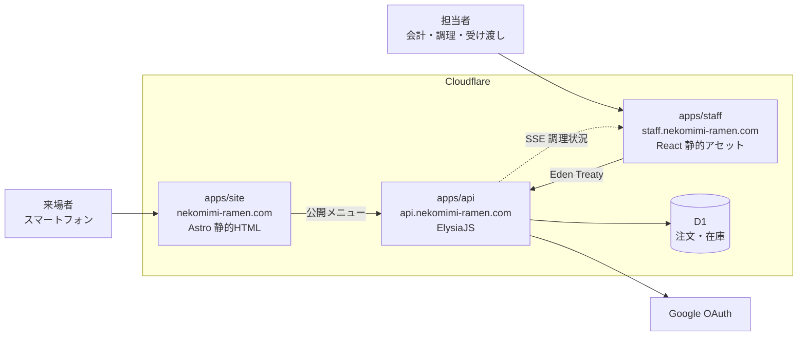

<div align="center">

# 猫耳メイドラーメン

**文化祭のクラス出店のための、注文から受け渡しまでを繋ぐ Web アプリケーション**

[](https://github.com/koutyuke/nekomimi-maid-ramen/actions/workflows/ci.yml)

2026 年 10 月末開催 ・ [nekomimi-ramen.com](https://nekomimi-ramen.com)

</div>

---

## これは何か

来場者は注文兼会計口で商品と個数を口頭で伝え、会計担当者が画面へ入力する。注文を確定した時点で在庫を減らし、注文番号を発行して調理担当者へ共有する。完成した注文は番号で照合して受け渡す。

口頭だけで会計から調理へ伝える運用では、注文漏れ、手計算の会計ミス、売り切れ商品の受付、受け渡しの取り違えが起きやすい。**同じ注文状況を全担当者が見られる状態を作ること**が目的である。

来場者は店へ着く前に、メニューと売り切れを確認できる。

利用者と全体像は[プロジェクト概要](docs/product/overview.md)を読む。

## 構成



3 つの Worker を別々のホストへ割り当て、**別々に配備する**。営業中に画面だけを直したいとき、API を巻き込んで Server-Sent Events の接続を切らないためである。

| 作業単位     | 配備先                     | 主な構成                                                               |
| ------------ | -------------------------- | ---------------------------------------------------------------------- |
| `apps/site`  | `nekomimi-ramen.com`       | Astro ・ TypeScript ・ Tailwind CSS                                    |
| `apps/staff` | `staff.nekomimi-ramen.com` | React ・ Vite ・ TanStack Router ・ TanStack Query ・ Jotai ・ Mantine |
| `apps/api`   | `api.nekomimi-ramen.com`   | ElysiaJS ・ Effect ・ Drizzle ORM ・ Cloudflare D1                     |

画面は Eden Treaty で `apps/api` の型を読む。依存の向きは画面から API への一方向に限り、API は画面の実装を参照しない。

API の内部は**業務領域で縦割り**にする。`src/features/{領域}/` の下に `domain`、`application`、`adapters`、`infra` を置き、仕様([`docs/specs/`](docs/specs/))と同じ切り方で読めるようにしている。エラーと依存は Effect の型に載せ、扱い忘れた失敗が型検査で残るようにする。

公開側はAstroで静的HTMLを生成し、メニュー取得とテーマ選択だけをブラウザーで実行する。テーマはライト・ダーク・端末設定の3択で、選択をブラウザーへ保存する。

スタッフ画面の内部も同じ業務領域で切る。`src/layers/` の下を Feature-Sliced Design の層(`app`、`pages`、`widgets`、`features`、`entities`、`shared`)で分け、部品は表示だけを担う Presenter と副作用を担う Container に分ける。

判断の根拠は [`DEC-SYS-003` 実行基盤とデータストア](docs/meta/decisions/DEC-SYS-003-technology-stack.md)、[`DEC-SYS-004` 開発環境とツールチェーン](docs/meta/decisions/DEC-SYS-004-development-environment.md)、[`DEC-SYS-005` API の内部構造とエラー処理](docs/meta/decisions/DEC-SYS-005-api-internal-structure.md)、[`DEC-SYS-006` 画面の内部構造と状態管理](docs/meta/decisions/DEC-SYS-006-web-internal-structure.md)にある。

## 準備

[Nix](https://nixos.org/download/) と [direnv](https://direnv.net/) を入れてから、

```sh
direnv allow
pnpm install
```

以降このディレクトリへ入るだけで Node.js と pnpm の版が揃う。direnv を使わない場合は各コマンドを `nix develop --command` の後ろに置く。

## 開発

```sh
pnpm dev                          # 公開側・スタッフ側・APIを同時に起動する
pnpm --filter @nekomimi/site dev  # 公開側だけ
pnpm --filter @nekomimi/staff dev # スタッフ側だけ
pnpm --filter @nekomimi/api dev   # API だけ
pnpm site sb                      # 公開側のStorybook（localhost:6007）
pnpm staff sb                     # スタッフ側のStorybook（localhost:6006）
pnpm site sb:build                # 公開側のStorybookを静的出力する
```

API の起動後は、[`http://localhost:8787/openapi`](http://localhost:8787/openapi) で API リファレンス、[`http://localhost:8787/openapi/json`](http://localhost:8787/openapi/json) で OpenAPI 仕様を確認できる。

初回と表定義を変えたときは、手元の D1 へ移行を当てる。

```sh
pnpm --filter @nekomimi/api db:generate       # 表定義から移行ファイルを作る
pnpm --filter @nekomimi/api db:migrate:local  # 手元の D1 へ適用する
pnpm --filter @nekomimi/api db:seed:local     # メニューと初期在庫を投入する
pnpm --filter @nekomimi/api db:studio         # 手元の D1 を Drizzle Studio で開く
```

投入する内容は `apps/api/seed.sql` にある。[メニュー](docs/product/menu.md)の6商品、特定原材料の9品目、全商品を販売可能にする初期在庫を入れる。品目の追加や価格の変更はこのファイルを直して投入し直す。何度実行しても行は重複せず、投入後に更新された説明文・原材料の確認状態・在庫数は上書きしない。

本番へ入れる場合は、移行を当てた後に `db:seed:remote` を実行する。

```sh
pnpm --filter @nekomimi/api db:seed:remote
```

画面とAPIのURLは共有パッケージの[`packages/core/src/http/url.ts`](packages/core/src/http/url.ts)で管理する。APIは`ENVIRONMENT=development`のときに開発用URLを使い、それ以外は本番用URLを使う。`pnpm --filter @nekomimi/api dev`は開発環境を指定して起動する。公開側とスタッフ側は`import.meta.env.PROD`で切り替える。

| 環境 | 公開側                       | スタッフ側                         | API                              |
| ---- | ---------------------------- | ---------------------------------- | -------------------------------- |
| 開発 | `http://localhost:4321`      | `http://localhost:5173`            | `http://localhost:8787`          |
| 本番 | `https://nekomimi-ramen.com` | `https://staff.nekomimi-ramen.com` | `https://api.nekomimi-ramen.com` |

スタッフの入口は`/`、注文は`/sales`、調理は`/kitchen`、受け渡しは`/handoff`、管理は`/admin`である。未認証で注文・調理・受け渡し・管理画面へアクセスすると`/`へ戻り、ログインを案内する。公開ホストの`/staff`以下は、`/staff`の接頭辞を除いてスタッフホストへ302転送する。

Staff以上の担当者は「調理」から確定注文の商品と数量を確認し、「調理を開始」「完成」で状態を進める。着手を取り消す場合は「未調理に戻す」を使う。他端末の変更はSSEで自動反映する。通信断や更新の競合では表示を確認し、「再読み込み」で最新の一覧を取得してから操作する。取り消し済みの注文は表示されない。

公開メニューのGETは認証不要で、公開ホストと、このプロジェクトの`nekomimi-ramen-web`・`nekomimi-ramen-staff`の`koutyuke.workers.dev`プレビューから閲覧できる。許可リストは`apps/api/src/core/http/origins.ts`、CORSの適用は`apps/api/src/plugins/cors/cors.plugin.ts`で管理する。認証と業務操作は、本番ではスタッフ側の送信元だけを許可する。開発ではポート変更に対応するため、`localhost`と`127.0.0.1`のHTTPをポートを問わず許可する。

## 検査

```sh
pnpm check       # lint、整形、型検査、試験をまとめて実行する
pnpm lint        # リポジトリ全体の oxlint を実行する
pnpm fmt         # リポジトリ全体を oxfmt で整形する
pnpm fmt:check
pnpm typecheck
pnpm test
```

`no-floating-promises` などの型情報を使う検査を有効にしている。注文の保存と在庫の減算は一つのバッチとして実行するため、`await` の書き忘れがエラーを出さないまま在庫を壊す。型情報がなければこの誤りは見つからない。

oxlintはルートから一度だけ実行し、対象ファイルに最も近い設定を使う。共通設定はルートの `oxlint.config.ts`、パッケージ固有の設定は `apps/*/oxlint.config.ts` に置く。oxfmtの設定はルートの `.oxfmtrc.jsonc` に置き、リポジトリ全体で同じ書式を使う。

コミット時は整形だけを行い、プッシュ時に lint、型検査、試験が lefthook で走る。

## 配備

`main` へ統合すると GitHub Actions が配備する。**変更された Worker だけ**が対象になる。共有パッケージ`packages/core/**`の変更では3つが対象になる。

| ワークフロー        | 契機                             | 内容                                 |
| ------------------- | -------------------------------- | ------------------------------------ |
| `ci.yml`            | プルリクエスト ・ `main`         | 静的検査、整形、型検査、試験、ビルド |
| `deploy-api.yml`    | `main` の `apps/api/**`          | 型検査、試験、D1 の移行適用、配備    |
| `deploy-site.yml`   | `main` の `apps/site/**`         | 型検査、試験、ビルド、配備           |
| `deploy-staff.yml`  | `main` の `apps/staff/**`        | 型検査、試験、ビルド、配備           |
| `preview-site.yml`  | プルリクエストの `apps/site/**`  | プレビュー版の作成とLighthouse計測   |
| `preview-staff.yml` | プルリクエストの `apps/staff/**` | プレビュー版の作成とURLの通知        |

配備するジョブは Environment `production` に属する。出店当日だけ Settings → Environments → production で Required reviewers を有効にすると承認待ちへ切り替わる。ワークフローの変更は要らない。

手元から配備する場合は次を使う。

```sh
pnpm --filter @nekomimi/api exec wrangler deploy
pnpm --filter @nekomimi/site run build && pnpm --filter @nekomimi/site exec wrangler deploy
pnpm --filter @nekomimi/staff run build && pnpm --filter @nekomimi/staff exec wrangler deploy
```

初回の分離配備は、スタッフ用Workerを作成してからAPIの送信元設定を反映し、最後に公開側を配備する。公開側は既存の`nekomimi-ramen-web`、スタッフ側は`nekomimi-ramen-staff`を使う。APIと公開側を切り替える間は従来ホストからの業務操作が拒否されるため、営業外に実施する。切り戻す場合は分離前の公開WorkerとAPIを組で戻す。

公開側のプレビューでは公開メニューも確認できる。スタッフ側の`workers.dev`プレビューは本番認証の許可対象外なので、業務操作の確認には開発環境またはスタッフ用の本番ホストを使う。

## 外部サービスの設定

スタッフのログイン画面は本番では`https://staff.nekomimi-ramen.com/`、手元では`http://localhost:5173/`にある。Google OAuthのクライアントを種類「ウェブ アプリケーション」で作成し、次の戻り先をGoogle Cloudへ登録する。

- 本番: `https://api.nekomimi-ramen.com/auth/google/callback`
- 手元: `http://localhost:8787/auth/google/callback`

Google OAuthはテスト状態とし、利用する学校アカウントをテストユーザーへ登録する。認証後も`gm.ibaraki-ct.ac.jp`以外を拒否する。手元では`apps/api/.dev.vars`へ次の設定を追加する。各設定を1行ずつ`KEY=value`形式で記述する。このファイルはGitへ含めない。

対象とする学校ドメインは`apps/api/wrangler.jsonc`の`SCHOOL_DOMAIN`で設定する。

| 設定                   | 内容                                                |
| ---------------------- | --------------------------------------------------- |
| `GOOGLE_CLIENT_ID`     | Google OAuthクライアントID                          |
| `GOOGLE_CLIENT_SECRET` | Google OAuthクライアントの秘密情報                  |
| `BETTER_AUTH_SECRET`   | `openssl rand -base64 32`で生成する認証用の秘密情報 |
| `OWNER_EMAIL`          | Ownerにする学校アカウントのメールアドレス           |

D1へ移行を適用してから`pnpm dev`を起動し、スタッフ側の開発サーバーが示す`http://localhost:ポート番号/`からログインする。認証ではAPIとホスト名を揃えるため、画面も`localhost`で開く。Owner以外の初期ロールはNoneである。OwnerまたはAdminでログインし、「管理ページ」から`/admin`を開くと、ログインしたことがある利用者の名前・メールアドレス・現在のロールを確認できる。

担当者が一度ログインした後、OwnerまたはAdminが一覧で対象者を確認し、Staffを選んで「変更する」を押す。権限を外す場合はNoneを選ぶ。Adminの付与・剥奪はOwnerだけが行える。AdminはNoneとStaffの間だけ変更できる。Ownerと自分自身のロールは変更できない。成功表示を確認し、対象者の画面で「権限を再確認」を押すと新しいロールを確認できる。APIへの次の操作には、再ログインせずに変更が適用される。

一覧取得や変更が失敗した場合は、権限と通信状況を確認し、「利用者一覧を再読み込み」で現在のロールを確認してから再試行する。管理者権限を失った場合は、Ownerへ再付与を依頼する。

本番の設定は、配備先を確認したうえで対話入力する。`BETTER_AUTH_SECRET`は本番用に別途生成する。

```sh
pnpm --filter @nekomimi/api exec wrangler secret put GOOGLE_CLIENT_ID
pnpm --filter @nekomimi/api exec wrangler secret put GOOGLE_CLIENT_SECRET
pnpm --filter @nekomimi/api exec wrangler secret put BETTER_AUTH_SECRET
pnpm --filter @nekomimi/api exec wrangler secret put OWNER_EMAIL
```

Google Cloudの戻り先は、共有パッケージで定義した環境別のAPI公開先に合わせる。認証の設定が不足している場合、公開ページは利用できるが、ログインは503、業務操作は401で拒否する。

設定後はOwnerと通常の学校アカウントでログインし、OwnerとNoneになること、ログアウト後に再ログインが必要になることを確認する。学校外の拒否を確認するときは、管理する学校外のテスト用アカウントもGoogleのテストユーザーへ登録し、Googleの同意画面を通過した後にアプリ側がログインを拒否することを確かめる。Google側で拒否された場合はアプリ側のドメイン判定を確認したことにはならない。

セッションは12時間で失効する。期限切れやアカウントの選択違いでは、学校アカウントを選んで再ログインする。再試行しても失敗する場合は管理者へ連絡し、管理者が4つの秘密情報、`SCHOOL_DOMAIN`、Googleのテストユーザー登録、戻り先URLと環境別のAPI公開先の一致、D1への移行適用を確認する。

`nekomimi-ramen.com`、`staff.nekomimi-ramen.com`、`api.nekomimi-ramen.com` の Custom Domain 割り当ては、初回の配備時に `wrangler` が作成する。

## 文書

要件と仕様は [`docs/`](docs/README.md) にある。

| 場所                             | 役割                               |
| -------------------------------- | ---------------------------------- |
| [`docs/product/`](docs/product/) | 目的、利用者、体験、用語           |
| [`docs/meta/`](docs/meta/)       | 要件、判断、未決事項、提供範囲     |
| [`docs/specs/`](docs/specs/)     | 業務領域ごとの振る舞いと受け入れ例 |

文書を更新する前に[ドキュメント管理](docs/documentation-management.md)を読む。ブランチを切る前とプルリクエストを作る前に[変更管理](docs/change-management.md)を読む。

不具合や作業を登録する場合は、[Issue の起票](docs/issue-management.md)を読む。
